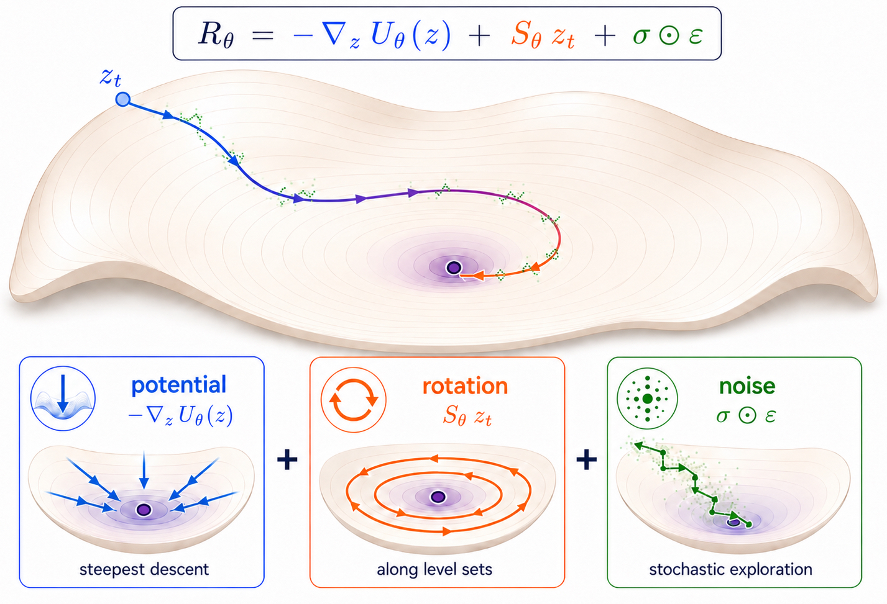

# Chreode

**A Cell World Model for One-Step Temporal Dynamics and Perturbation Prediction**

Mufan Qiu¹, Genhui Zheng², Yinuo Xu³, Ruichen Zhang¹, Ying Ding², Qi Long³, Tianlong Chen¹

¹ University of North Carolina at Chapel Hill   ² The University of Texas at Austin   ³ University of Pennsylvania

[**Paper (PDF)**](paper/chreode.pdf) · [**arXiv**](https://arxiv.org/abs/2606.XXXXX) · [**Pretrained weights**](https://huggingface.co/WhenceFade/chreode-pretrained) · [**Downstream checkpoints**](https://huggingface.co/WhenceFade/chreode-downstream) · [**Phase-0 artifacts**](https://huggingface.co/datasets/WhenceFade/chreode-phase0)

---

<p align="center">
  
</p>

Chreode is a **one-step** cell world model. Given a latent transcriptional state $z_t$, an elapsed time $\Delta$, and an optional action $a$, the model predicts a future state in a single forward pass:

$$
\hat z_{t+\Delta} \;=\; z_t \;+\; \alpha(\Delta)\bigl[\,\underbrace{-\nabla_z U_\theta}_{\text{downhill potential}} \;+\; \underbrace{S_\theta\,z_t}_{\text{antisymmetric flow}} \;+\; \underbrace{\sigma_\theta\odot\epsilon}_{\text{stochastic spread}}\bigr]
$$

The backbone is pretrained on a **2.47M-cell mouse embryonic atlas** (7 datasets, 10 leaf trajectories, 88 timepoints), then transferred zero-shot or via short fine-tuning to four downstream tasks reported in the paper.

## Headline numbers (from the paper)

| Task | Metric | Best baseline | **Chreode** |
|---|---|---|---|
| Weinreb hematopoiesis d6 (fine-tune) | Sinkhorn $W_2$ ↓ | PRESCIENT 1.885 / PI-SDE 1.840 | **1.688 ± 0.036** |
| Veres islet differentiation avg t1–t7 (fine-tune) | Sinkhorn $W_2$ ↓ | PI-SDE 2.830 | **2.617** |
| Weinreb clonal fate (zero-shot) | Pearson r ↑ (masked) | scDiffEq 0.463 | **0.468** |
| Norman Perturb-seq via GEARS embedding replace | DE20 MSE ↓ | GEARS 0.21208 | **0.18580** (−12.4%) |
| Inference latency (A100, batch 1, fp32) | ms / NFE | PRESCIENT 194 ms / many | **65 ms / 1** |

Full tables, ablations, and protocol details are in [paper/chreode.pdf](paper/chreode.pdf).

---

## Repo structure

```
Chreode/
├── paper/chreode.pdf           # The paper.
├── src/cellworldmodel/         # Python package (installed via `pip install -e .`)
│   ├── foundation/             # Stage 1 VAE, Stage 2 W-DiT, perturbation arms,
│   │                           # action encoders, transition index, latent cache.
│   ├── model/                  # W-DiT, DriftDiT, baseline architectures.
│   ├── benchmark/              # Downstream-task adapters (Weinreb, Veres, ...).
│   ├── evaluation/             # Sinkhorn W2, MMD, fate metrics, DE20.
│   ├── training/               # Loss balancer, split policy, transition sampler.
│   ├── data/                   # Preprocessing helpers.
│   └── script/                 # Entry-point scripts (run_intermediate_eval, ...).
├── workflow/foundation/        # Snakemake rules: catalog → VAE → latent →
│                               # dynamics → perturbation → eval.
├── config/                     # The configs that produced the paper numbers.
│   ├── foundation_genhui_v1.yaml             # Main Stage-1 + Stage-2 + Norman.
│   └── paper_bench/                          # Downstream fine-tune configs.
├── scripts/                    # download_*.py, reproduce_*.sh.
├── reproduce/                  # One markdown per paper experiment.
│   ├── 01_pretrain.md
│   ├── 02_weinreb.md           # Table 1
│   ├── 03_veres.md             # Table 2
│   ├── 04_fate.md              # Table 3
│   ├── 05_norman.md            # Table 4
│   ├── 06_velocity_consistency.md   # Appendix H
│   ├── 07_timing.md            # Appendix G
│   └── known_issues.md
├── tests/                      # pytest unit tests.
├── pyproject.toml
└── LICENSE                     # MIT
```

## Install

The training stack depends on the right PyTorch + CUDA wheel for your GPU, so install PyTorch first, then this package and its other dependencies.

```bash
# 1. Clone
git clone https://github.com/mufanq/Chreode.git
cd Chreode

# 2. Create a virtualenv (we recommend `uv`)
python -m venv .venv && source .venv/bin/activate
# or: uv venv && source .venv/bin/activate

# 3. Install PyTorch with the CUDA build that matches your driver.
#    See https://pytorch.org/get-started/locally/ for the right command.
#    Example (CUDA 12.1):
pip install torch==2.5.1 --index-url https://download.pytorch.org/whl/cu121

# 4. Install Chreode + Python deps (editable mode).
pip install -e ".[scvi,workflow]"

# 5. (Optional, only needed for Norman GEARS reproduction) install gears env.
# See reproduce/05_norman.md for the sm_120 / Blackwell caveat.
pip install -e ".[gears]"
```

Verify install:

```bash
python -c "import cellworldmodel; print(cellworldmodel.__version__)"
pytest tests/test_foundation_config.py tests/test_foundation_vae.py -q
```

## Quick start: pretrained inference in 5 lines

```python
from huggingface_hub import snapshot_download
from cellworldmodel.foundation import load_chreode_backbone   # Stage 1 VAE + Stage 2 W-DiT

ckpt_dir = snapshot_download(repo_id="WhenceFade/chreode-pretrained")
model = load_chreode_backbone(ckpt_dir, device="cuda")

# Given expression matrix X (cells × 16,520 mouse–human orthologs) at time t,
# predict the population at t + delta in a single forward pass.
z_t      = model.encode(X)                                 # (N, 128)
z_target = model.predict(z_t, delta=1.0)                   # (N, 128)
X_target = model.decode(z_target)                          # (N, 16520)
```

The helper `load_chreode_backbone` constructs the encoder and dynamics head from `config/foundation_genhui_v1.yaml`, then loads the weights from `ckpt_dir/vae.pt` and `ckpt_dir/dynamics_dit.pt`. See [reproduce/01_pretrain.md](reproduce/01_pretrain.md) for the exact config the released checkpoints were trained with.

## Reproducing the paper

Every result in the paper has a markdown file under `reproduce/` with the exact command, config, expected number, and rough runtime. Run them in roughly this order — only `01_pretrain.md` is expensive, the rest take minutes to a few hours with the released checkpoints.

| Doc | Paper section | Expected runtime (1× A100) |
|---|---|---|
| [01_pretrain.md](reproduce/01_pretrain.md) | §4 / App. A.1, A.2 | ≈ 12 h for Stage 1, ≈ 18 h for Stage 2 (one GPU each). **Optional** — download released weights instead. |
| [02_weinreb.md](reproduce/02_weinreb.md) | §5.1 / Table 1 | ≈ 1.5 h per seed × 3 seeds |
| [03_veres.md](reproduce/03_veres.md) | §5.2 / Table 2 | ≈ 2 h per seed × 3 seeds |
| [04_fate.md](reproduce/04_fate.md) | §5.3 / Table 3 | ≈ 10 min (zero-shot inference + 20-NN classifier) |
| [05_norman.md](reproduce/05_norman.md) | §5.4 / Table 4 | ≈ 90 min (1 seed; the paper number is 1-seed — see [known_issues.md](reproduce/known_issues.md)) |
| [06_velocity_consistency.md](reproduce/06_velocity_consistency.md) | App. H / Table 8 | ≈ 20 min (3 seeds, EMT + MOSTA) |
| [07_timing.md](reproduce/07_timing.md) | App. G / Table 7 | ≈ 2 min |

The Snakemake workflow under `workflow/foundation/` orchestrates the full pretrain → downstream chain. If you only want one task, the `reproduce/0X_*.md` script invokes the relevant target directly.

## Known issues (please read before reproducing)

Three operational facts are not in the paper but matter for reproduction. See [reproduce/known_issues.md](reproduce/known_issues.md) for the full list:

1. **Norman numbers are 1-seed.** The paper's `DE20 MSE 0.21208 → 0.18580` is from a single seed. A 3-seed rerun does not preserve the ranking. The released GEARS-replace pipeline uses the same 1-seed protocol; users who want multi-seed confidence intervals should run more seeds and report both.
2. **Stage-1 VAE uses a batch covariate fallback.** `foundation_genhui_v1.yaml` sets `allow_unknown_batch=true` so Norman cells, which were not seen at pretrain, get a null batch code at encoding time. This is part of the paper recipe; the strict-zero-shot variant (no fallback) is shipped as an optional config but is **not** what produced the table.
3. **GEARS on Blackwell (sm_120) needs a specific stack.** PyTorch 2.12-dev + numpy 1.26.4 + `USE_FLAX=0`. The released GEARS env is documented in [reproduce/05_norman.md](reproduce/05_norman.md).

## Releases on HuggingFace

| Artifact | Repo | Contents | Size |
|---|---|---|---|
| Pretrained backbone | [`WhenceFade/chreode-pretrained`](https://huggingface.co/WhenceFade/chreode-pretrained) | Stage 1 scVI encoder; Stage 2 Waddington-DiT (Dynamics); Stage 2 Static-DiT (control arm for §5.4) | ≈ 4 GB |
| Downstream fine-tuned | [`WhenceFade/chreode-downstream`](https://huggingface.co/WhenceFade/chreode-downstream) | Weinreb (3 seeds) and Veres (3 seeds) fine-tuned heads | ≈ 230 MB |
| Phase-0 preprocessing | [`WhenceFade/chreode-phase0`](https://huggingface.co/datasets/WhenceFade/chreode-phase0) | Mouse–human 1:1 ortholog vocabulary, unified cell index, split manifest, downstream-task h5ad slices | ≈ 5.6 GB |

`scripts/download_weights.py` and `scripts/download_phase0.py` wrap `huggingface_hub.snapshot_download` and place files where the `reproduce/` instructions expect them.

## Citation

If you use Chreode in your research, please cite:

```bibtex
@inproceedings{qiu2026chreode,
  title     = {Chreode: A Cell World Model for One-Step Temporal Dynamics and Perturbation Prediction},
  author    = {Qiu, Mufan and Zheng, Genhui and Xu, Yinuo and Zhang, Ruichen and Ding, Ying and Long, Qi and Chen, Tianlong},
  booktitle = {Advances in Neural Information Processing Systems},
  year      = {2026}
}
```

## License

MIT — see [LICENSE](LICENSE). Pretraining and downstream datasets retain their original licenses; see Appendix E of the paper.

## Acknowledgements

Built on top of [scVI-tools](https://scvi-tools.org/), [GEARS](https://github.com/snap-stanford/GEARS), [Drifting Models](https://arxiv.org/abs/2602.04770), and the [moscot / WOT / PRESCIENT / BranchSBM / CellFlow](paper/chreode.pdf) ecosystem of single-cell dynamics methods. We thank the authors of those projects for releasing their code.
